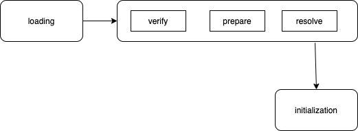

# 类加载器

## 类加载系统
类加载系统负责将类文件`.class`从本地或网络上加载到jvm的方法区中以便创建对象实例，加载系统只负责类文件的加载，文件是否能够运行有Execution Engine决定。  
`.class`文件的加载主要由类加载`classloader`负责，加载过程分为三个阶段  
1. loading阶段：将类加载至jvm内存中，加载完成会生成一个该类的`java.lang.Class`对象
2. link阶段分为三步：
   - verify：验证阶段确保class类字节流文件符合jvm虚拟机规范
   -  prepare：为类变量分配内存空间并设置初始值，不包括final修饰的static属性，final修饰的属性在编译阶段已经分配空间（不一定赋值），类变量会分配在方法区中（元空间），实例属性则会在实例创建时分配在堆内存中
   - resolve：将class文件中的符号引用转化为直接引用，
3. initialization阶段：初始化阶段就是执行构造类的构造器`<clinit>()`方法（jvm收集类变量的赋值动作和静态代码块自动生成），自动执行类静态属性赋值操作和静态代码块中的代码，此方法是线程安全的，如果有父类，jvm保证父类的该方法先执行然后再执行子类的`<clinit>()`方法，如果没有类变量和静态代码块则不会生成该方法。注意区分该方法和`<init>()`方法，`<init>()`方法是由根据构造类实例的构造器生成。  

## 加载器分类
JVM支持两种类加载器：引导类加载器(bootstrap classloader)和自定义类加载器(user-defined classloader)，在jvm中一般将派生自ClassLoader的类加载器成为自定义类加载器，虚拟机自带三种类加载器  
- 启动类加载器（bootstrap classloader）
  - 启动类加载器不继承自ClassLoader，没有父类加载器，并且指定自己为扩展类加载器和系统类加载器的父类
  - 出于安全考虑启动类加载器只加载特定包名开头的类文件，如java、javax、sun等
- 扩展类加载器
  - 派生于ClassLoader类
  - 从java.ext.dirs环境变量或者jdk安装的jre/lib/ext文件夹下加载，用户jar放在此处也会被加载
  - 父类加载器为引导类加载器
- 应用程序加载器（系统类加载器）
  - 派生于ClassLoader，父类加载器为扩展类加载器
  - 负责加载classpath环境变量或系统属性java.class.path指定路径下的类库
  - 该加载器是默认的类加载器，一般情况java应用都是该类加载器加载，可由`ClassLoader.getSystemClassLoader()`获取
- 用户也可自定义类加载器以实现一些特殊功能  
## 类加载器的一些api
### getParent
- 返回该类加载器的超类
### loadClass(String name)
- 加载name类，返回一个java.lang.Class实例
### findClass(String name)
- 查找name类，返回一个java.lang.Class实例
### findLoadedClass(String name)
- 加载名为name的已加载类，返回一个java.lang.Class实例
### defineClass(String name，byte[] b, int off, int len)
- 从字节数组中加载一个类，名称为name，返回一个java.lang.Class实例
### resolveClass(Class<?> czz)
- 连接一个指定类
## 双亲委派机制
双亲委派机制可以防止人为覆盖系统启动类，具体流程为：
1. 一个类加载器收到加载类请求，会转发给父类加载器
2. 如果父类加载器还有超类加载器则继续向上传递
3. 如果顶层加载器能完成加载，则加载完结束流程，否则依次向下传递加载任务直至加载成功，否则抛出异常
## 其他
- java中判断两个类对象是否一样需要满足两个条件
  - 来自同一分类文件
  - 由同一个classloader加载
- Class类对象会保存加载自己的类加载器的引用