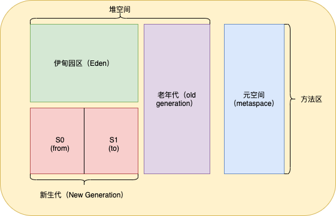

# 堆

## 介绍
- 一个JVM实例只存在一个堆内存，堆是jvm内存管理的核心区域，堆的大小在jvm创建时就已经确定，所有线程都共享堆内存，线程私有的缓冲区（Thread Local Allocation Buffer TLAB）也在堆中
- 几乎所有对象实例和数组都应当在运行时分配在堆中，在方法结束后堆中的对象不会马上移除，而是在垃圾回收时移除
- 现代垃圾收集器大部分基于分代收集理论设计，java7及之前分为新生代、老年代、永久代，java8及以后分为新生代、老年代、元空间

## 配置堆
- -Xms：用于配置起始堆大小
- -Xmx：用于配置堆区的最大内存
::: tip
通常会将-Xms和-Xmx配置为相同大小，目的是为了在垃圾回收完毕后不再重新分割计算堆区大小，从而提高性能  
默认情况下：初始内存为物理机cpu的1/64，最大内存为物理机的1/4
:::
## 年轻代与老年代
堆区可细分为年轻代和老年代，年轻代又可分为Eden区、Survivor0区（form区）、Survivor1区（to区），在hotspot中Eden和两个S0,S1区的默认空间占比为8:1:1，几乎所有对象都是在Eden区被new出来的
## 对象分配
1. 新创建出的对象都是存放在Eden区
2. 当Eden区空间不足时会触发minor GC，回收不再被引用的对象，将剩余对象存放到survivor区，再将新建对象存放到Eden区
3. 当再次触发minor GC时，Eden区剩余对象移动到S1区，S0此时变为from区，S1区变为to区，将S0区中对象放到S1区
4. 如果经过多次minor GC后对象依然存在于新生代（S0、S1）中，则会被放到老年代中，默认经历GC次数为15次
::: tip
可以通过-XX:MaxTenuingThreshold=\<N\>来设置这个次数
:::
5. 如果老年代空间不足就会发生major GC，major GC对整个堆空间进行GC
6. 如果GC后依然空间不足，则会报OOM错误

## GC分类
GC分为Minor GC、Major GC、Full GC，在jvm中大部分回收都在新生代执行。针对hotspot虚拟机，按照回收区域分为了两大类：部分收集和整堆收集。
- 年轻代GC触发时机：
  - 当年轻代空间不足（Eden区满，Surivor区满不会触发）时就会触发Minor GC
  - Minor GC执行时会引发STW，暂停用户线程，等垃圾回收完毕才能恢复运行
- 老年代GC触发时机：
  - 对象从老年代消失时就发生了Major GC或Full GC
  - 当Major GC发生时通常都伴随着Minor GC
  - Major GC速度慢，STW时间更长
- Full GC触发时机：
  - 调用System.gc()时，系统建议执行GC，不一定执行
  - 老年代空间不足时
  - 方法区内存不足时
  - 通过Minor GC进入老年代的平均大小大于老年代可用内存
  - 由Eden区、Survivor的From区想Survivor的To区复制时空间不足，转而向old区复制空间依然不足
## 参数设置
- -XX:+PrintFlagsInitial：查看参数的初始值
- -XX:+PrintFlagsFinal：查看参数的最终值
- -Xms：配置堆空间的初始大小
- -Xmx：配置堆空间的最大内存
- -Xmn：设置新生代空间大小
- -XX:NewRatio：设置新生代与老年代在堆中的空间占比
- -XX:SurvivorRatio：设置新生代中Eden与Survivor区的占比
- -XX:MaxTenuringThreshold：设置新生代垃圾的最大年龄
- -XX:PringGCDetails：输出GC的详细信息
## 逃逸分析
一个局部变量在方法执行中自始至终都没有逃离本方法，则表示该变量没有发生逃逸  
根据逃逸分析结果可以做以下优化：  
- 栈上分配：将堆分配转化为栈分配
- 同步省略：一个共享数据没有逃逸，则没有必要同步，执行消锁
- 对象分解标量替换：一个对象变量没有逃逸，则可以用该对象内部的基本属性来替换这个对象