# 对象实例化

## 创建对象
对象实例化方法及对象创建过程

## 对象内存分布对应

对象的访问，hotspot采用的是直接指针访问模式。
## 对象头
对象头分为两种：
1. 普通对象头
2. 数组对象头
两者区别在于数组对象头比普通对象头多了一个记录数组长度的槽。对象头具体存储内容有两部分：Mark Word、Class Refer。其中Mark Word存储hash值、GC age、偏向锁标志、轻量级锁标志、重量级锁标志、锁引用、GC标志，Class Refer存储一个指向方法区该类元信息的引用。  
Mark Word在不同状态存储的内容不同具体为：  

| Mark Word(32位) | State |
| :---------: | :-----------: |
| identity_hashcode:25 \| age:4 \| biased_lock:1 \| lock:2 | Normal |
| thread:23 \| epoch:2 \| age:4 \| biased_lock:1 \| lock:2 | Biased |
| ptr_to_lock_record:30          \| lock:2 | Lightweight Locked |
| ptr_to_heavyweight_monitor:30  \| lock:2 | Heavyweight Locked |
|     \| lock:2 | Marked For GC |