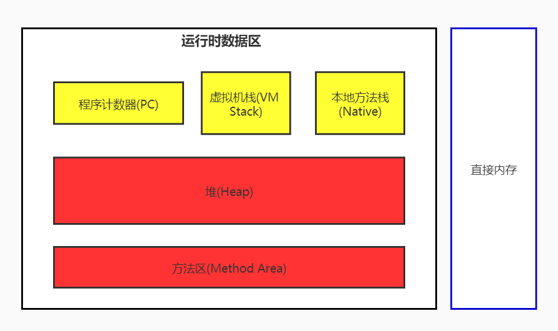

# 运行时数据区和线程

## 介绍
jvm启动时会创建方法区（又叫元空间）和堆区，并为所有线程共享，pc计数器、虚拟机栈和本地方法栈是线程独有的
## 线程
jvm的每个线程都与本地线程直接映射，线程调度是由操作系统控制。  
jvm中的系统线程主要有：
- 虚拟机线程：这种线程的操作需要虚拟机到达安全点才会执行，这样堆才不会变化，包括STW、偏向锁撤销、线程栈收集等
- 周期任务线程：一般用于周期性时间的任务，如中断
- GC线程：垃圾回收线程
- 编译线程：在运行时将字节码编译成本地代码
- 信号调度线程：接收信号发送给jvm
## 程序计数器
程序计数器用来存储下一条指令的地址，每个线程都有一个自己的程序计数器，它的生命周期和线程相同